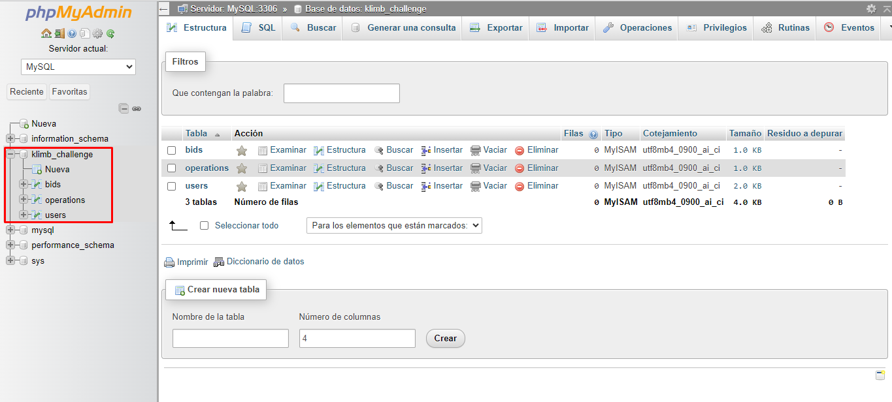
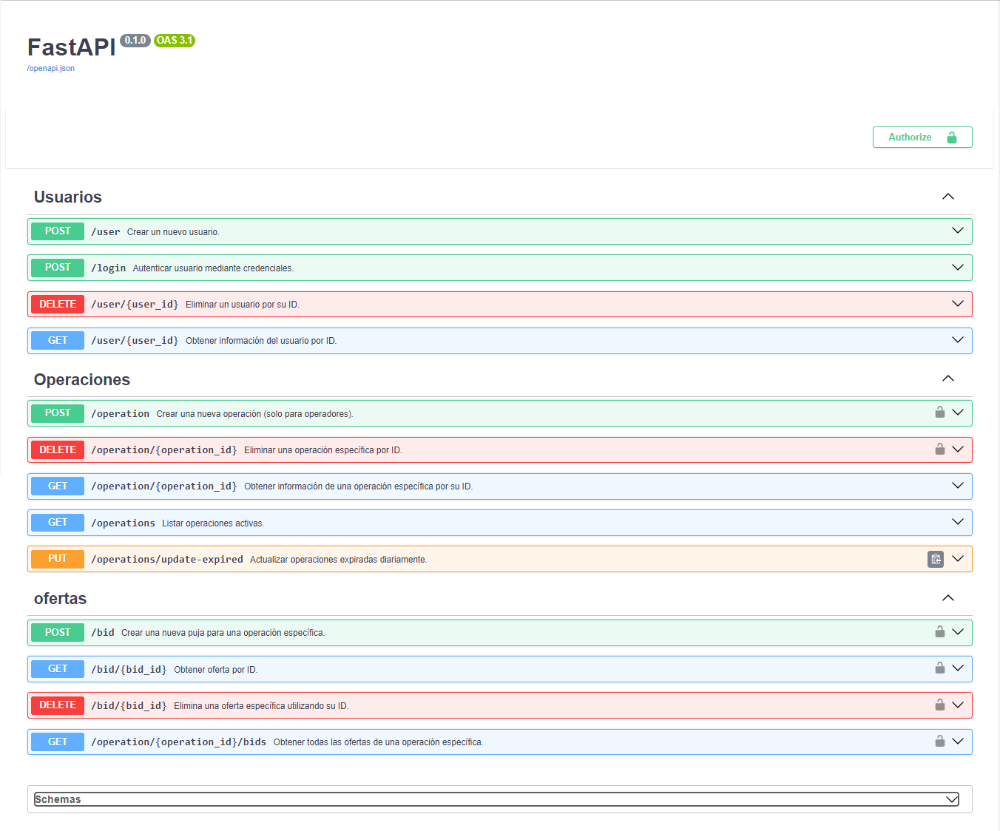
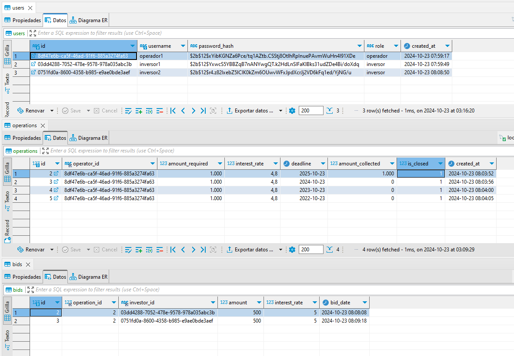

# Klimb Challenge - Sistema de Subastas para Operaciones Financieras

Este proyecto es una solución para el challenge de un sistema de subastas en tiempo real para operaciones financieras. Está construido utilizando FastAPI y SQLAlchemy, con una base de datos MySQL.

<div align="center">
    <a href="https://youtu.be/6ocFro_jHXw">Ver el tutorial de implementación y ejecución</a>
</div>


## Requisitos

- Python 3.11.9
- WampServer (para MySQL)
- Entorno virtual (recomendado)

## Instalación

### 1. Instalación de WampServer
- Descarga e instala [WampServer](https://www.wampserver.com/en/).
- Abre WampServer y navega a `localhost` en tu navegador.
- Ve a `phpMyAdmin` y crea una base de datos MySQL llamada `klimb_challenge`.

### 2. Clonar el Repositorio
Clona este repositorio localmente:

```bash
git clone https://github.com/Carlos99archila/klimb_challenge.git
cd klimb_challenge
```

### 3. Crear la Base de Datos
- Abre `phpMyAdmin`, crea una base de datos llamada `klimb_challenge` e ingresa en ella.
- Copia y pega el contenido del archivo `docs/create_tables.sql` en la sección de `SQL de phpMyAdmin` y ejecútalo. Esto creará las tablas necesarias para el proyecto.

 <div align="center">
    <figure>
        <a href="./">
            
        </a>
        <figcaption>Base de datos con las tablas</figcaption>
    </figure>
</div>


### 4. Crear un entorno virtual
Crea un entorno virtual con Python 3.11.9:

``` bash
.venv\Scripts\activate
```

### 5. Instalar Dependencias
Instala las dependencias del proyecto:

```bash
pip install -r requirements.txt
```

### 6. Ejecutar la Aplicación
Para ejecutar la API:

``` bash
uvicorn app.main:app --reload
```
Esto levantará el servidor en `http://127.0.0.1:8000/`. Puedes acceder a la documentación interactiva de la API en `http://127.0.0.1:8000/docs`.

<div align="center">
    <figure>
        <a href="./">
            
        </a>
        <figcaption>API cargada y documentada</figcaption>
    </figure>
</div>

<div align="center">
    <figure>
        <a href="./">
            
        </a>
        <figcaption>Database con las pruebas realizadas en el video</figcaption>
    </figure>
</div>

### 7. Ejecutar Pruebas
Para ejecutar las pruebas unitarias:
```bash
pytest tests/test_users.py
```

## Tecnologías Utilizadas
- FastAPI: Para la creación de la API.
- SQLAlchemy: Para interactuar con la base de datos MySQL.
- JWT: Para la autenticación de usuarios y roles.
- MySQL: Base de datos utilizada.
- Uvicorn: Servidor ASGI para ejecutar la API.
- pytest: Para las pruebas unitarias.
  
## Funcionalidades
Rutas de usuarios:
- `POST` /users: Crear un nuevo usuario.
- `POST` /login: Autenticar usuario mediante credenciales.
- `GET` /user/{user_id}: Obtener información del usuario por ID.
- `DELETE` /user/{user_id}: Eliminar un usuario por su ID.
  
Rutas de operaciones:
- `POST` /operation: Crear una nueva operación (solo para operadores).
- `GET` /operations: Listar operaciones activas.
- `GET` /operation/{operation_id}: Obtener información de una operación específica por su ID.
- `PUT` /operations/update-expired: Actualizar operaciones expiradas diariamente.
- `DELETE` /operation/{operation_id}: Eliminar una operación específica por ID.
  
Rutas de pujas:
- `POST` /bid: Crear una nueva puja para una operación específica (solo para inversores).
- `GET` /bid/{bid_id}: Obtener información de una oferta por ID.
- `GET` /operation/{operation_id}/bids: Obtener todas las ofertas de una operación específica.
- `DELETE` /bid/{bid_id}: Elimina una oferta específica utilizando su ID.

## Decisiones de Diseño
- Se utilizó FastAPI por su eficiencia y facilidad de uso.
- La autenticación está basada en JWT para mantener la seguridad de las rutas sensibles.
- SQLAlchemy se usó para mantener la flexibilidad y control sobre la base de datos MySQL.
